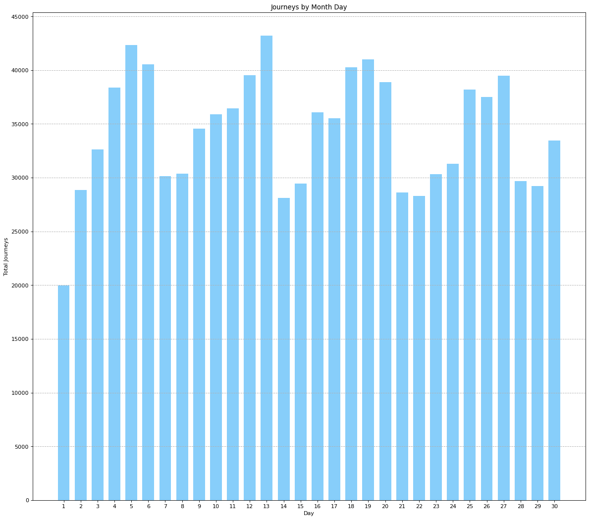
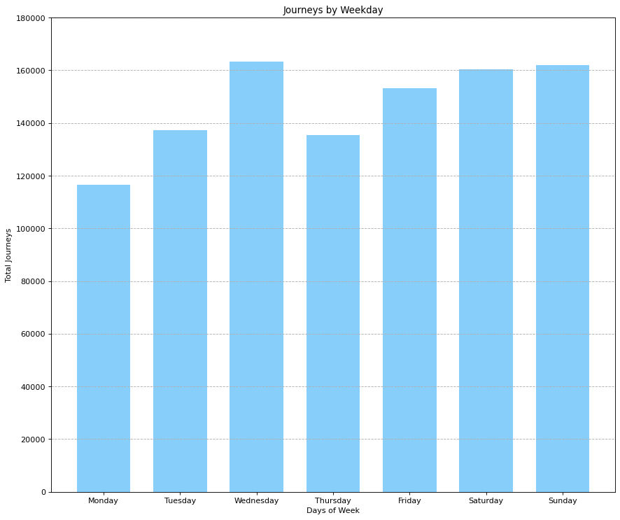
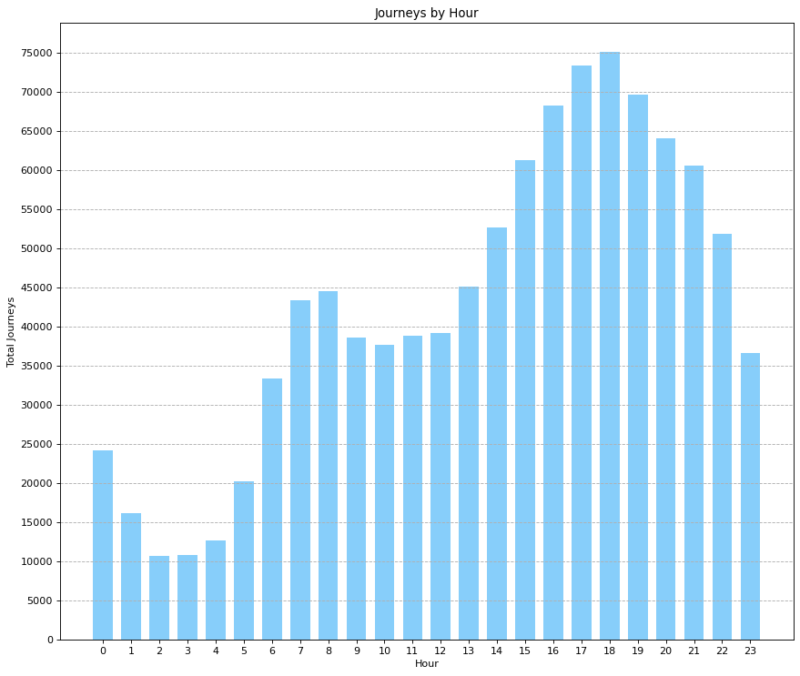
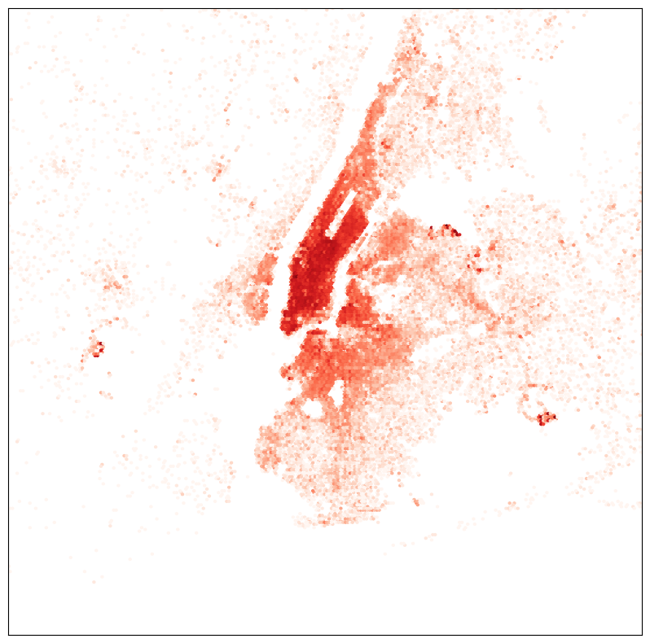

```python
import os
import sys
spark_name = os.environ.get('SPARK_HOME',None)
if not spark_name:
    raise ValueError('SPARK_HOME not set')
sys.path.insert(0,os.path.join(spark_name,'python'))
sys.path.insert(0,os.path.join(spark_name,'python/lib/py4j-0.10.7-src.zip'))
exec(open(os.path.join(spark_name,'python/pyspark/shell.py')).read())
```

    Welcome to
          ____              __
         / __/__  ___ _____/ /__
        _\ \/ _ \/ _ `/ __/  '_/
       /__ / .__/\_,_/_/ /_/\_\   version 3.5.0
          /_/
    
    Using Python version 3.11.5 (main, Sep 11 2023 13:26:23)
    Spark context Web UI available at http://172.24.63.179:4040
    Spark context available as 'sc' (master = local[*], app id = local-1695959518514).
    SparkSession available as 'spark'.


#测试pyspark是否可以使用#


```python
import findspark
findspark.init()
from pyspark import SparkContext
sc.stop()
sc = SparkContext("local","count app")
words = sc.parallelize(
    ["scala",
     "java",
     "hadoop",
     "spark",
     "akka",
     "spark vs hadoop",
     "pyspark",
     "pyspark and spark"]
)
counts = words.count()
print(counts)
```

    8


#从HDFS中读取数据#


```python
from pyspark.sql import SparkSession
spark = SparkSession.builder.getOrCreate()
df = spark.read.csv('Uber/uber-raw-data-sep14.csv',header=True)
print(df)
```

    DataFrame[Date/Time: string, Lat: string, Lon: string, Base: string]


#对网约车出行的时间分布进行分析#


```python
from pyspark.sql.functions import to_date, to_timestamp
dateDF = df.select(to_timestamp(df['Date/Time'], 
                                   'MM/dd/yyyy HH:mm:ss').alias('date'))

```

解析日期时收到如下异常：

```
You can set \"spark.sql.legacy.timeParserPolicy\" to \"LEGACY\" to restore the behavior before Spark 3.0, or set to \"CORRECTED\" and treat it as an invalid datetime string.\r\n\tat org.apache.spark.sql.errors.
```

发现下面一行代码可以解决问题


```python
spark.sql("set spark.sql.legacy.timeParserPolicy=LEGACY")
```


    DataFrame[key: string, value: string]


```python
dateDF.show()
```

    +-------------------+
    |               date|
    +-------------------+
    |2014-09-01 00:01:00|
    |2014-09-01 00:01:00|
    |2014-09-01 00:03:00|
    |2014-09-01 00:06:00|
    |2014-09-01 00:11:00|
    |2014-09-01 00:12:00|
    |2014-09-01 00:15:00|
    |2014-09-01 00:16:00|
    |2014-09-01 00:32:00|
    |2014-09-01 00:33:00|
    |2014-09-01 00:33:00|
    |2014-09-01 00:37:00|
    |2014-09-01 00:38:00|
    |2014-09-01 00:39:00|
    |2014-09-01 00:48:00|
    |2014-09-01 00:48:00|
    |2014-09-01 00:49:00|
    |2014-09-01 01:08:00|
    |2014-09-01 01:17:00|
    |2014-09-01 01:19:00|
    +-------------------+
    only showing top 20 rows


​    

#统计一月内的分布#
利用SQL中GroupBy和count进行按月统计


```python
from pyspark.sql.functions import year,month,dayofmonth
stats_d = dateDF.select(
    dayofmonth('date').alias('day')
).groupBy('day').count().sort('day').collect()

print(stats_d)
```

    [Row(day=1, count=19961), Row(day=2, count=28831), Row(day=3, count=32631), Row(day=4, count=38360), Row(day=5, count=42319), Row(day=6, count=40520), Row(day=7, count=30134), Row(day=8, count=30360), Row(day=9, count=34560), Row(day=10, count=35910), Row(day=11, count=36439), Row(day=12, count=39540), Row(day=13, count=43205), Row(day=14, count=28122), Row(day=15, count=29454), Row(day=16, count=36092), Row(day=17, count=35531), Row(day=18, count=40274), Row(day=19, count=41017), Row(day=20, count=38864), Row(day=21, count=28620), Row(day=22, count=28312), Row(day=23, count=30316), Row(day=24, count=31301), Row(day=25, count=38203), Row(day=26, count=37504), Row(day=27, count=39468), Row(day=28, count=29656), Row(day=29, count=29201), Row(day=30, count=33431)]


#使用matplotlib绘制柱状图#


```python
import matplotlib.pyplot as plt
import numpy as np

plt.figure(figsize=(18,16), dpi=80)
plt.subplot(1,1,1)
plt.grid(axis="y", linestyle='--')
width= 0.7

N = len(stats_d)
values = [d['count'] for d in stats_d]
index = np.arange(1,N+1)

p2 = plt.bar(index, values, width, color="#87CEFA")

plt.xlabel('Day')
plt.ylabel('Total Journeys')
plt.title('Journeys by Month Day')

plt.xticks(index)
plt.yticks(np.arange(0,50000,5000))

plt.show()
```


​    

​    


#一周内的分布#


```python
from pyspark.sql.functions import dayofweek
stats_w = dateDF.select(
    dayofweek('date').alias('weekday')
).groupBy('weekday').count().sort('weekday').collect()

print(stats_w)
```

    [Row(weekday=1, count=116532), Row(weekday=2, count=137288), Row(weekday=3, count=163230), Row(weekday=4, count=135373), Row(weekday=5, count=153276), Row(weekday=6, count=160380), Row(weekday=7, count=162057)]


```python
plt.figure(figsize=(13,11), dpi=80)
plt.subplot(1,1,1)
plt.grid(axis="y", linestyle='--')
width = 0.7

N = len(stats_w)
values = [d['count'] for d in stats_w]
index = np.arange(N)

p2 = plt.bar(index, values, width, color="#87CEFA")

plt.xlabel('Days of Week')
plt.ylabel('Total Journeys')
plt.title('Journeys by Weekday')

plt.xticks(index, ('Monday', 'Tuesday', 'Wednesday', 'Thursday', 'Friday', 
                   'Saturday', 'Sunday'))
plt.yticks(np.arange(0, 200000, 20000))

plt.show()
```


​    

​    


#一天内的分布#


```python
from pyspark.sql.functions import hour
stats_h = dateDF.select(
    hour('date').alias('hour')
).groupBy('hour').count().sort('hour').collect()

print(stats_h)
```

    [Row(hour=0, count=24133), Row(hour=1, count=16107), Row(hour=2, count=10702), Row(hour=3, count=10789), Row(hour=4, count=12675), Row(hour=5, count=20262), Row(hour=6, count=33307), Row(hour=7, count=43314), Row(hour=8, count=44477), Row(hour=9, count=38542), Row(hour=10, count=37634), Row(hour=11, count=38821), Row(hour=12, count=39193), Row(hour=13, count=45042), Row(hour=14, count=52643), Row(hour=15, count=61219), Row(hour=16, count=68224), Row(hour=17, count=73373), Row(hour=18, count=75040), Row(hour=19, count=69660), Row(hour=20, count=63988), Row(hour=21, count=60606), Row(hour=22, count=51817), Row(hour=23, count=36568)]


```python
plt.figure(figsize=(13,11), dpi=80)
plt.subplot(1,1,1)
plt.grid(axis="y", linestyle='--')
width = 0.7

N = len(stats_h)
values = [d['count'] for d in stats_h]
index = np.arange(N)

p2 = plt.bar(index, values, width, color="#87CEFA")

plt.xlabel('Hour')
plt.ylabel('Total Journeys')
plt.title('Journeys by Hour')

plt.xticks(index)
plt.yticks(np.arange(0, 80000, 5000))

plt.show()
```


​    

​    


#网约车空间分布分析#


```python
import pandas as pd
import numpy as np
import seaborn as sns
import matplotlib.pyplot as plt
import os
import conda

conda_file_dir = conda.__file__
conda_dir = conda_file_dir.split('lib')[0]
proj_lib = os.path.join(os.path.join(conda_dir, 'share'), 'proj')
os.environ["PROJ_LIB"] = proj_lib


from mpl_toolkits.basemap import Basemap
from matplotlib import cm

x_a = np.array([float(r['Lon']) for r in df.select(df['Lon']).collect()])
y_a = np.array([float(r['Lat']) for r in df.select(df['Lat']).collect()])
```

#绘制热度图#


```python
west, south, east, north = -74.26, 40.50, -73.70, 40.92
fig = plt.figure(figsize=(14,10))
ax = fig.add_subplot(111)
m = Basemap(projection='merc', llcrnrlat=south, urcrnrlat=north, 
            llcrnrlon=west, urcrnrlon=east, lat_ts=south, resolution='i')
x,y = m(x_a, y_a)
m.hexbin(x, y,gridsize=1000, bins='log',cmap=cm.Reds)
```


    <matplotlib.collections.PolyCollection at 0x27660922c50>


​    

​    

